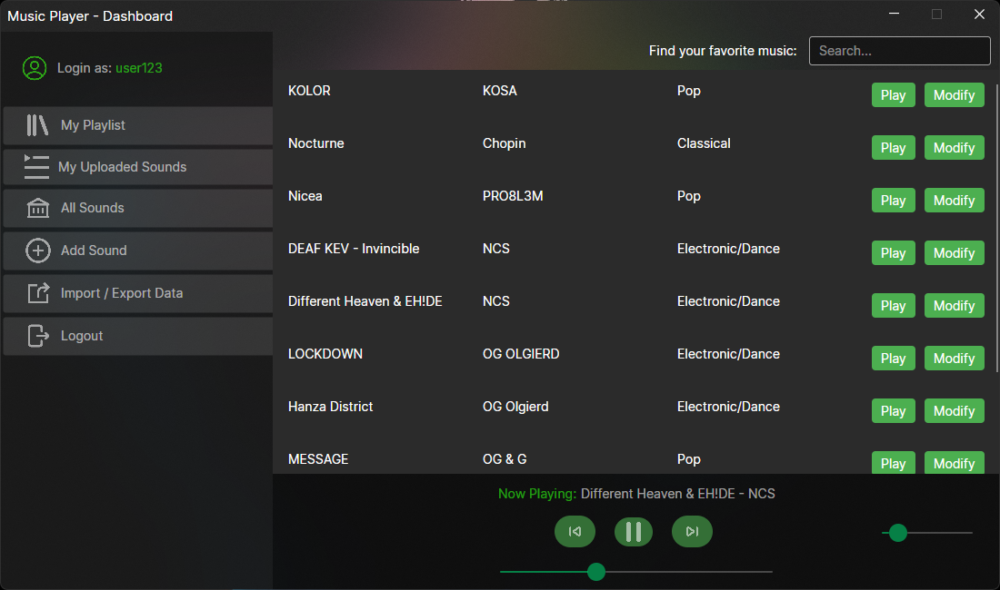

[](https://github.com/byko-dev/music-player/actions/workflows/dotnet-build.yml)

# Music Player



The Music Player project is a versatile, multi-platform application designed for music enthusiasts. Developed using C# and the .NET 6 framework, this application offers a seamless experience across Windows and Linux operating systems. Leveraging the capabilities of Avalonia, created a modern and intuitive graphical user interface (GUI) that stands out for its aesthetics and user-friendly navigation.

### Technologies used in project:

1. Language: C#
2. UI Toolkit: Avalonia
3. CI/CD: GitHub Actions
4. Containerization: Docker-compose
5. Database: SQL with Entity Framework Core

### `docker-compose.yml` file
```
version: '3.1'

services:
  mysql:
    image: mysql:latest
    restart: always
    environment:
      MYSQL_ROOT_PASSWORD: root
      MYSQL_DATABASE: basebase
      MYSQL_USER: admin
      MYSQL_PASSWORD: root
    ports:
      - "3306:3306"
    volumes:
      - C:\\Local_Data_Directory:/var/lib/mysql 
```

### Migration EFC cheatsheet
``` 
dotnet tool install --global dotnet-ef --version=6.0.25

dotnet ef migrations add Migration_Name

dotnet ef database update
```

`Developed by byko-dev 2024`
